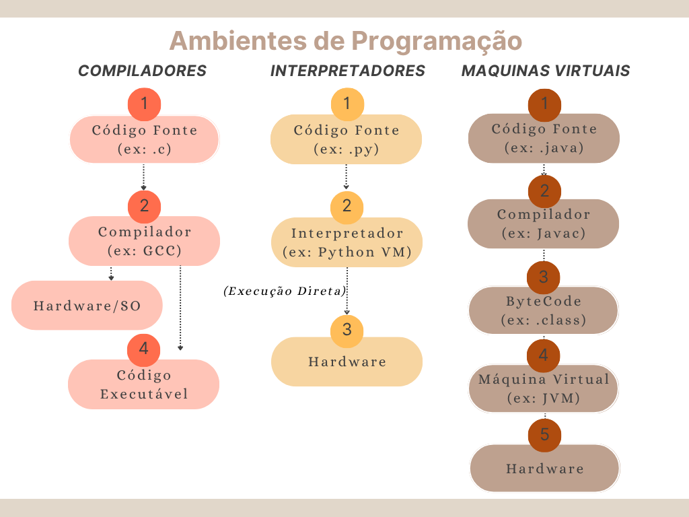

# Desafio 2: Ambientes de Programação

Este diretório contém um diagrama explicando compiladores, interpretadores e máquinas virtuais, com exemplos escolhidos.

## Diagrama Explicativo

Abaixo, apresento um diagrama que ilustra o funcionamento e a relação entre compiladores, interpretadores e máquinas virtuais, acompanhado de exemplos de linguagens que utilizam cada abordagem:

### Compiladores

Um **compilador** é um programa que traduz o código-fonte escrito em uma linguagem de alto nível para um código de máquina (ou outro formato binário de baixo nível) que pode ser executado diretamente pelo processador do computador. Este processo de tradução ocorre antes da execução do programa.
* **Processo:** O compilador lê todo o código-fonte, realiza análises (léxica, sintática, semântica) e otimizações, e gera um arquivo executável autônomo. Se houver erros, eles são reportados na fase de compilação.
* **Vantagens:** Programas compilados tendem a ser mais rápidos em tempo de execução, pois a tradução já foi feita. O código é otimizado para a arquitetura alvo.
* **Desvantagens:** Requer uma etapa de compilação explícita antes de cada execução de alteração. O executável gerado não é facilmente portável entre diferentes sistemas operacionais ou arquiteturas sem recompilação.
* **Exemplos de Linguagens:** C, C++, Go, Rust, Swift.

### Interpretadores

Um **interpretador** é um programa que executa o código-fonte diretamente, linha por linha, sem a necessidade de uma etapa de compilação prévia para um arquivo executável binário completo.
* **Processo:** O interpretador lê uma instrução do código-fonte, a traduz e executa imediatamente, e então passa para a próxima instrução. A tradução e execução ocorrem em tempo de execução.
* **Vantagens:** Flexibilidade e rapidez no desenvolvimento e testes, pois não há um passo de compilação demorado. Maior portabilidade, já que o mesmo código-fonte pode rodar em qualquer sistema com o interpretador compatível.
* **Desvantagens:** Geralmente mais lento em tempo de execução do que programas compilados, devido à tradução contínua. Requer que o interpretador esteja presente no ambiente de execução.
* **Exemplos de Linguagens:** Python, Ruby, JavaScript (usado em navegadores ou com Node.js), PHP.

### Máquinas Virtuais (VMs)

Uma **Máquina Virtual** (VM) é um ambiente de execução de software que abstrai o hardware subjacente, permitindo que o código seja executado de forma consistente em diferentes plataformas. Em muitas linguagens (como Java e C#), o código-fonte é primeiro compilado para um formato intermediário chamado **bytecode**, que é então executado pela VM.
* **Processo:** O código-fonte é compilado para bytecode. A VM (ex: JVM para Java, CLR para C#) lê esse bytecode e o executa em tempo real, muitas vezes utilizando compiladores Just-In-Time (JIT) para otimizar o desempenho dinamicamente.
* **Vantagens:** Alta portabilidade ("escreva uma vez, execute em qualquer lugar"), pois o bytecode é independente da plataforma. Oferece um ambiente seguro e gerenciado (ex: gerenciamento automático de memória - Garbage Collection).
* **Desvantagens:** Pode ter um overhead de desempenho em comparação com programas compilados diretamente para código de máquina devido à camada da VM. Requer a VM instalada no sistema.
* **Exemplos de Linguagens/Plataformas:** Java (JVM - Java Virtual Machine), C# (.NET Common Language Runtime - CLR), Kotlin (JVM), Scala (JVM).

## Conclusão

A escolha da arquitetura de execução (compilado, interpretado ou VMs) tem um impacto significativo nas características de uma linguagem de programação, incluindo seu desempenho, portabilidade, ambiente de desenvolvimento e segurança. Entender essas diferenças é essencial para tomar decisões informadas no design e na implementação de software.
