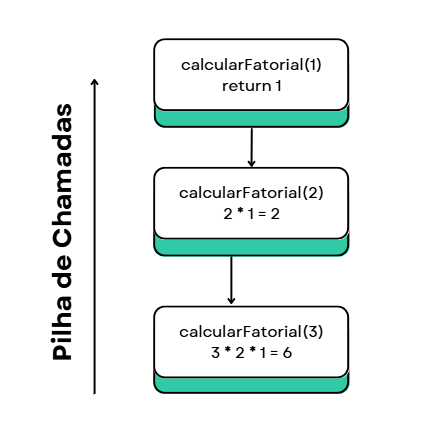

# Desafio 7: Implementação de Subprogramas - Pilha de Chamadas (Recursão)

Este diretório foca na implementação de um subprograma recursivo e, crucialmente, na **visualização e explicação de como a pilha de chamadas (call stack) funciona** durante a execução de chamadas recursivas.

## O Que é Recursão?

Recursão é uma técnica de programação onde uma função (ou método) chama a si mesma para resolver um problema. Para que seja eficaz e não resulte em um loop infinito, toda função recursiva deve ter:

* **Caso Base:** Uma condição de parada que não envolve chamadas recursivas adicionais. É o ponto onde a função retorna um valor diretamente.
* **Passo Recursivo:** A parte da função que chama a si mesma, geralmente com um problema menor ou mais simples que se aproxima do caso base.

## A Pilha de Chamadas (Call Stack)

A pilha de chamadas é uma estrutura de dados (tipo LIFO - Last In, First Out) que gerencia as chamadas de funções/métodos em um programa. Cada vez que uma função é chamada, uma nova "moldura de pilha" (ou *stack frame*) é empilhada. Essa moldura contém:

* Variáveis locais da função.
* Os parâmetros passados para a função.
* O endereço de retorno (onde o programa deve continuar após a função terminar).

Em uma recursão, múltiplas molduras de pilha para a mesma função são empilhadas sucessivamente. Quando o caso base é atingido e a função começa a retornar valores, essas molduras são desempilhadas na ordem inversa em que foram adicionadas.

## Exemplo: Cálculo do Fatorial Recursivo em Java

Utilizamos o cálculo do fatorial de um número como exemplo prático de recursão, pois ele se encaixa perfeitamente na definição recursiva:
* `0! = 1` (Caso Base)
* `n! = n * (n-1)!` para `n > 0` (Passo Recursivo)

* **Arquivo:** `FatorialRecursivo.java`

```java
import java.util.Scanner; // Importa a classe Scanner para ler a entrada do usuário

public class FatorialRecursivo {
    public static long calcularFatorial(int n) {
        // --- Caso Base da Recursão ---
        // Se n é 0, o fatorial é 1. Esta é a condição de parada da recursão.
        if (n == 0) {
            System.out.println("  Caso Base atingido: calcularFatorial(0) retorna 1");
            return 1;
        }
        // --- Condição de erro para números negativos ---
        else if (n < 0) {
            throw new IllegalArgumentException("Não é possível calcular o fatorial de um número negativo.");
        }
        // --- Passo Recursivo ---
        // Se n não é 0, o fatorial de n é n multiplicado pelo fatorial de (n-1).
        // A função chama a si mesma com um problema menor (n-1).
        else {
            System.out.println("  Chamada recursiva: calcularFatorial(" + n + ") chamando calcularFatorial(" + (n - 1) + ")");
            long resultadoAnterior = calcularFatorial(n - 1); // Chamada recursiva
            long resultadoAtual = n * resultadoAnterior;
            System.out.println("  Retornando de calcularFatorial(" + n + "): " + n + " * " + resultadoAnterior + " = " + resultadoAtual);
            return resultadoAtual;
        }
    }

    public static void main(String[] args) {
        Scanner scanner = new Scanner(System.in);

        System.out.println("--- Demonstração de Função Recursiva: Cálculo do Fatorial ---");
        System.out.print("Digite um número inteiro não negativo para calcular o fatorial: ");

        try {
            int numero = scanner.nextInt(); // Lê o número fornecido pelo usuário

            long fatorial = calcularFatorial(numero); // Chama a função recursiva
            System.out.println("\nO fatorial de " + numero + " é: " + fatorial);
        } catch (IllegalArgumentException e) {
            System.out.println("Erro: " + e.getMessage());
        } catch (java.util.InputMismatchException e) {
            System.out.println("Erro: Entrada inválida. Por favor, digite um número inteiro.");
        } finally {
            scanner.close(); // Garante que o scanner seja fechado
        }
    }
}
```
## Desenho e Explicação da Pilha de Chamadas para calcularFatorial(3)


### Explicação Detalhada do Processo:

1. Chamada Inicial (main() chama calcularFatorial(3)):

* main() é a primeira na pilha.

* calcularFatorial(3) é empilhada acima dela. n = 3.

* calcularFatorial(3) chama calcularFatorial(2).

2. Chamada Recursiva (calcularFatorial(2)):

* calcularFatorial(2) é empilhada acima de calcularFatorial(3). n = 2.

* calcularFatorial(2) chama calcularFatorial(1).

3. Chamada Recursiva (calcularFatorial(1)):

* calcularFatorial(1) é empilhada acima de calcularFatorial(2). n = 1.

* calcularFatorial(1) chama calcularFatorial(0).

4. Chamada do Caso Base (calcularFatorial(0)):

* calcularFatorial(0) é empilhada no topo. n = 0.

* Atinge o Caso Base: n == 0 é verdadeiro. calcularFatorial(0) retorna 1.

5. Desempilhamento e Retorno (calcularFatorial(1)):

* A moldura de calcularFatorial(0) é removida.

* calcularFatorial(1) recebe o 1 de calcularFatorial(0).

* calcularFatorial(1) calcula 1 * 1 = 1. Retorna 1.

6. Desempilhamento e Retorno (calcularFatorial(2)):

* A moldura de calcularFatorial(1) é removida.

* calcularFatorial(2) recebe o 1 de calcularFatorial(1).

* calcularFatorial(2) calcula 2 * 1 = 2. Retorna 2.

7. Desempilhamento e Retorno (calcularFatorial(3)):

* A moldura de calcularFatorial(2) é removida.

* calcularFatorial(3) recebe o 2 de calcularFatorial(2).

* calcularFatorial(3) calcula 3 * 2 = 6. Retorna 6.

8. Retorno Final (main()):

* A moldura de calcularFatorial(3) é removida.

* main() recebe o 6 e exibe o resultado. A pilha volta a conter apenas main() e, ao final do programa, fica vazia.

# Conclusão
A recursão é uma ferramenta poderosa para resolver problemas que podem ser divididos em subproblemas menores, semelhantes ao original. No entanto, é crucial entender o mecanismo da pilha de chamadas para compreender como cada invocação da função mantém seu próprio estado e como os resultados são passados de volta. Um caso base bem definido é a chave para evitar StackOverflowError (estouro de pilha), que ocorreria se a recursão nunca terminasse de empilhar.
