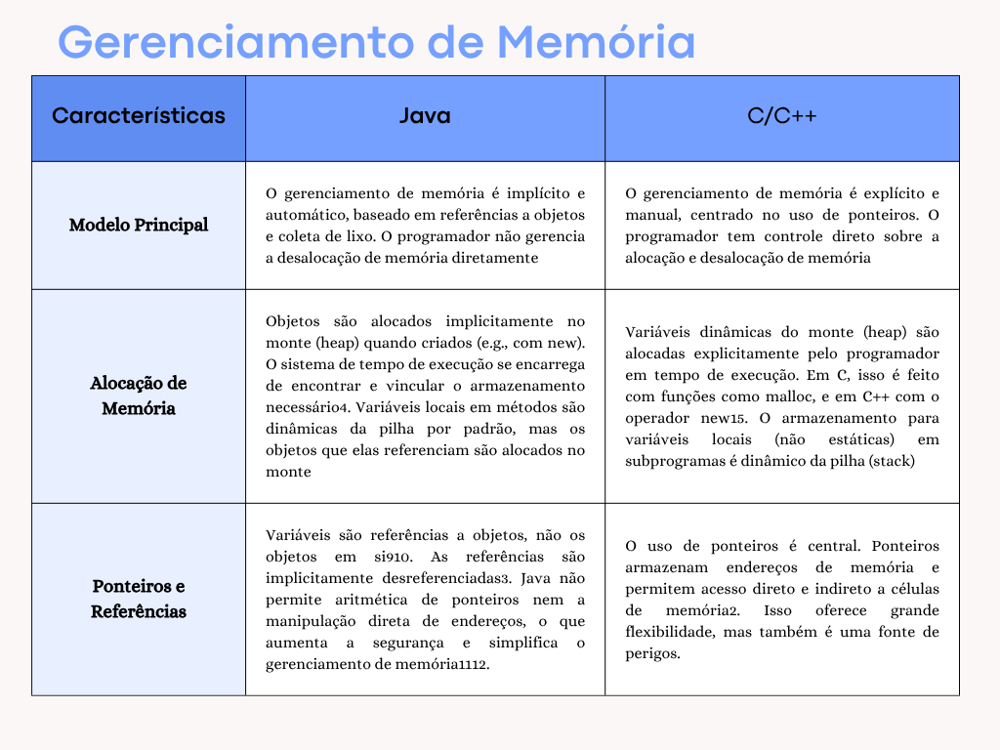

# Desafio 10: Gerenciamento de Memória - Quadro Comparativo

Este diretório contém a pesquisa e um quadro comparativo sobre como o gerenciamento de memória ocorre em duas linguagens de programação distintas: **Java** e **C++**. Compreender a gestão de memória é fundamental para escrever código eficiente e robusto, especialmente em sistemas com restrições de recursos.

## Introdução ao Gerenciamento de Memória

O gerenciamento de memória é o processo de controlar e coordenar a memória de um computador, alocando blocos de memória para programas quando eles precisam e liberando-os quando não são mais necessários. O modo como isso é feito varia significativamente entre as linguagens de programação, impactando a performance, segurança e a complexidade do desenvolvimento.

## Quadro Comparativo: Gerenciamento de Memória em Java vs. C++

Para ilustrar as diferentes abordagens, o quadro abaixo compara o gerenciamento de memória nas linguagens Java (com foco em seu Garbage Collector) e C++ (com gerenciamento manual e o auxílio de Smart Pointers no C++ moderno).

### Pontos Chave do Comparativo:

* **Modelo Principal:** O gerenciamento de memória em Java é implícito e automático, baseado em referências a objetos e coleta de lixo. O programador não gerencia a desalocação de memória diretamente. Em contraste, C/C++ adota um gerenciamento explícito e manual, centrado no uso de ponteiros, dando ao programador controle direto sobre a alocação e desalocação de memória.
* **Alocação de Memória:** Em Java, objetos são alocados implicitamente na heap (monte) quando criados com `new`. Variáveis locais em métodos são dinâmicas da pilha (stack), mas os objetos que elas referenciam são alocados no monte. Em C/C++, variáveis dinâmicas da heap são alocadas explicitamente pelo programador (ex: `malloc` em C, `new` em C++). Variáveis locais não estáticas em subprogramas são dinâmicas da pilha.
* **Ponteiros e Referências:** Em Java, variáveis são referências a objetos, não os objetos em si. As referências são implicitamente desreferenciadas. Java não permite aritmética de ponteiros nem manipulação direta de endereços, o que aumenta a segurança e simplifica o gerenciamento de memória. O uso de ponteiros é central em C/C++, permitindo acesso direto e indireto a células de memória, o que oferece grande flexibilidade, mas também riscos.
* **Liberação de Memória:** Em Java, a memória não utilizada é recuperada automaticamente por um mecanismo chamado coleta de lixo (Garbage Collection - GC). Isso elimina grande parte dos vazamentos de memória e problemas de ponteiros soltos que podem ocorrer com o gerenciamento manual. Em C/C++, a memória alocada dinamicamente deve ser liberada explicitamente pelo programador usando `free` (em C) ou `delete` (em C++). Se a liberação não for feita, ocorrem vazamentos de memória (memory leaks).
* **Confiabilidade e Segurança:** Java é mais confiável e seguro devido ao gerenciamento automático de memória. Embora seja fortemente tipada (erros de tipo são sempre detectados), a presença de coerções implícitas pode enfraquecer alguns de seus benefícios na detecção de erros. C/C++ é considerado menos seguro e confiável devido à necessidade de gerenciamento manual e aos perigos inerentes aos ponteiros, que podem levar a erros difíceis de depurar e quebra de segurança de memória.
* **Performance:** Java geralmente tem um desempenho um pouco inferior em operações intensivas de memória em comparação com C/C++, devido à sobrecarga da coleta de lixo, que pode introduzir pausas imprevisíveis (embora as implementações modernas de coletores de lixo sejam muito eficientes). C/C++ potencialmente oferece maior controle e eficiência para o programador experiente, pois o gerenciamento manual pode ser otimizado para cenários específicos, evitando a sobrecarga da coleta de lixo. No entanto, o custo de desenvolvimento e depuração pode ser maior.

## Conclusão

A escolha entre uma linguagem com gerenciamento de memória automático (como Java) e uma com gerenciamento manual (como C++) depende das necessidades específicas do projeto. Linguagens com GC priorizam a segurança do desenvolvedor e a produtividade, reduzindo a chance de erros de memória, embora possam introduzir um overhead de desempenho. Já linguagens com gerenciamento manual oferecem controle e otimização máximos, mas exigem um conhecimento aprofundado e maior responsabilidade do programador para evitar falhas graves de memória. Ambas as abordagens têm seu lugar no desenvolvimento de software, e a compreensão de seus mecanismos é crucial para qualquer programador.

